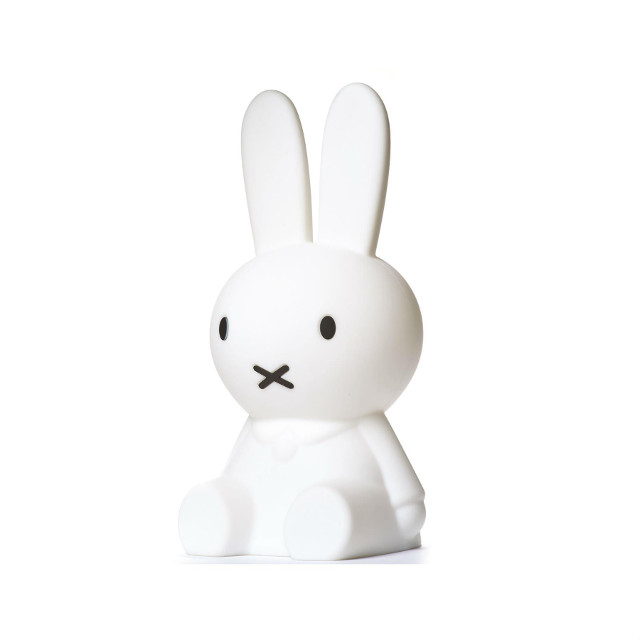

# Class 5

Practice surface modelling and editing methods.  Introduction to primitive volumes and Boolean operations.


# Topics
```
## Surface Review
- Lightbulb
- Candela roof

## Volumes
- Primitive
- Revolve
- Extrude surface

##3D Transformations
- Twist
- Boolean operations


```

# Practice Assignment



__Example__

<div id="canvas" style="width: 100%; height: 320px;"></div>

<script type="text/javascript" src="/viewer/resources/three.min.js"></script>
<script type="text/javascript" src="/viewer/resources/OrbitControls.js"></script>
<script type="text/javascript" src="/viewer/resources/rhino3dm.js"></script>
<script type="text/javascript">

    var modelURL = '/viewer/models/Nijntje.3dm';

    let fetchPromise = fetch(modelURL);

    rhino3dm().then(async m => {
        let rhino = m;

        let res = await fetchPromise;
        let buffer = await res.arrayBuffer();
        let arr = new Uint8Array(buffer);
        let doc = rhino.File3dm.fromByteArray(arr);

        THREE.Object3D.DefaultUp = new THREE.Vector3(0,0,1)
        init();
        let material = new THREE.MeshNormalMaterial();

        let objects = doc.objects();
        for (let i = 0; i < objects.count; i++) {
            let mesh = objects.get(i).geometry();
            if(mesh instanceof rhino.Mesh) {
                // convert all meshes in 3dm model into threejs objects
                let threeMesh = meshToThreejs(mesh, material);
                scene.add(threeMesh);
            }
        }
    });

    var scene, camera, renderer, controls;

    function init(){
        scene = new THREE.Scene();
        scene.background = new THREE.Color(1,1,1);
        camera = new THREE.PerspectiveCamera( 45, window.innerWidth/window.innerHeight, 1, 10000 );
        camera.position.set(900, 450, 900)

        renderer = new THREE.WebGLRenderer({antialias: true});
        renderer.setPixelRatio( window.devicePixelRatio );
        renderer.setSize( window.innerWidth, window.innerHeight );
        var canvas = document.getElementById("canvas");
        canvas.appendChild( renderer.domElement );

        controls = new THREE.OrbitControls( camera, renderer.domElement  );

        window.addEventListener( 'resize', onWindowResize, false );
        animate();
    }

    var animate = function () {
        requestAnimationFrame( animate );
        controls.update();
        renderer.render( scene, camera );
    };

    function onWindowResize() {
        camera.aspect = window.innerWidth / window.innerHeight;
        camera.updateProjectionMatrix();
        renderer.setSize( window.innerWidth, window.innerHeight );
        animate();
    }

    function meshToThreejs(mesh, material) {
        let loader = new THREE.BufferGeometryLoader();
        var geometry = loader.parse(mesh.toThreejsJSON());
        return new THREE.Mesh(geometry, material);
    }
</script>